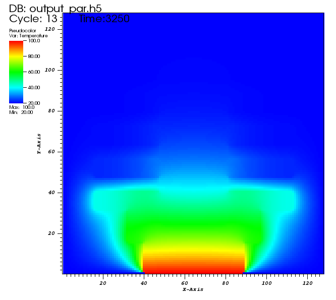
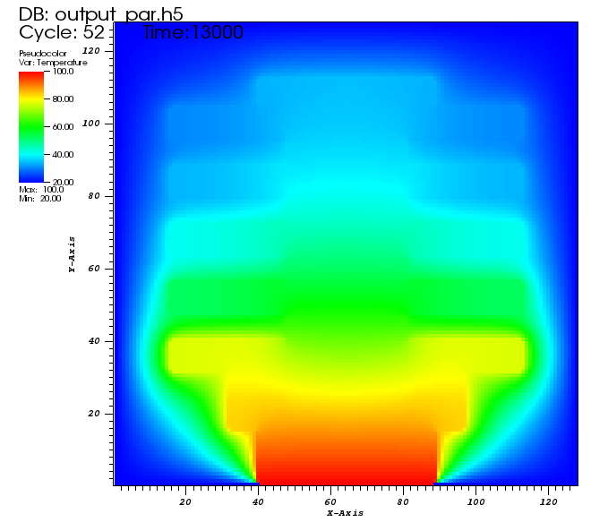
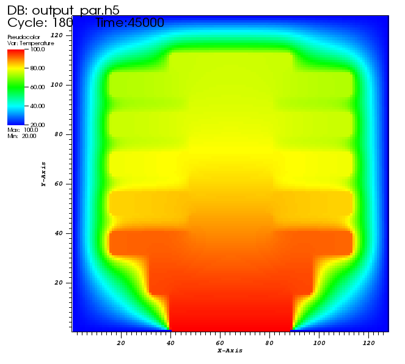

# Processor cooler simulation

Parallel simulation of heat diffusion in cooler mounted on processor. Simplified in only two dimensions. Visualisations of output are below.
Program has several parameters setting length of simulation, density of output, number of threads and more. 

Two exact same implementations were created, one with OpenMP library in folder [OpenMP](OpenMP),which has two versions - nonoverlapped output and overlapped, and second using OpenMPI library in [OpenMPI](OpenMPI). To run each type of implementation having installed respective library is necessary.

April-May 2015

## Author
* Jakub Kvita - kvitajakub@gmail.com

## Gallery

